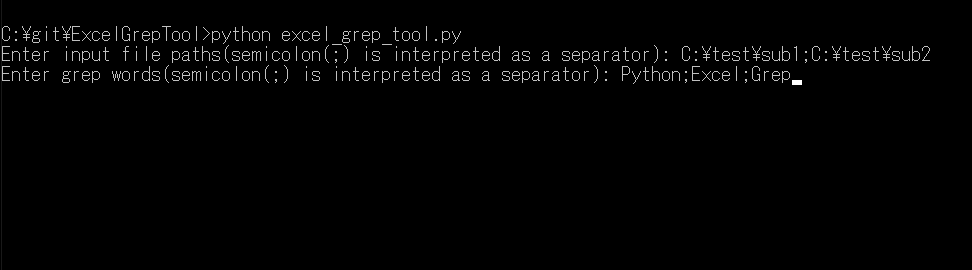
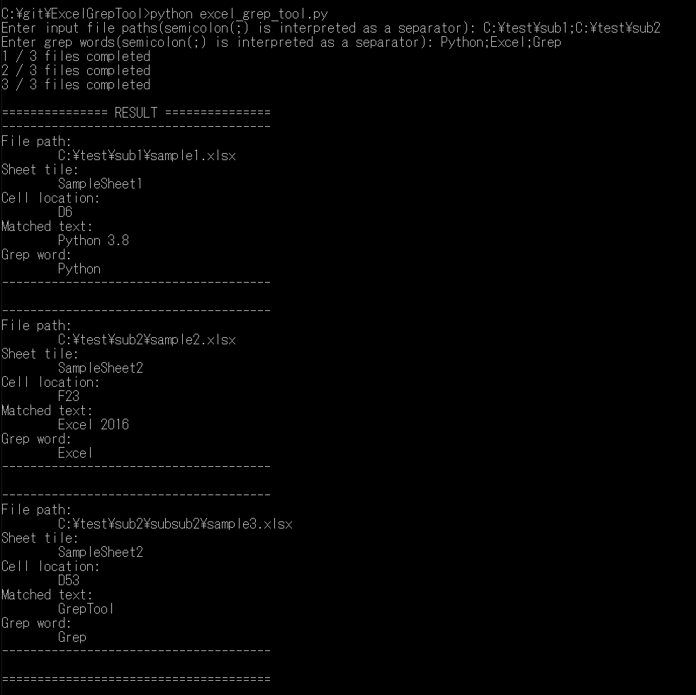

# ExcelGrepTool
CUI tool to grep Excel files, written in Python.

## How to use
### 1. Install modules
- `pip install -r requirements.txt`

### 2. Run
- `python excel_grep_tool.py`

## Screenshots

  
  
  

